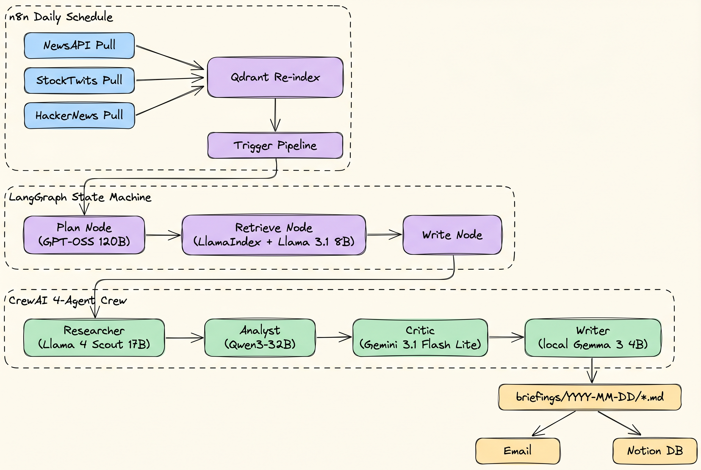

# AMIA: Autonomous Market Intelligence Agent

A multi-agent system that produces a daily briefing for 5 stock tickers (AAPL, TSLA, NVDA, MSFT, AMZN) by pulling news, retail sentiment, and tech discussion, retrieving the relevant slice via RAG, and writing a citation-backed summary through a 4-agent crew.

Built on a Mac M3 with 8GB RAM and **a $0 monthly bill** — everything runs on local Ollama plus free API tiers.

## What it does

Each morning, n8n triggers an ingestion run that pulls:

1. NewsAPI articles, ~40 per ticker
2. StockTwits messages with bullish/bearish sentiment labels
3. HackerNews stories via the Algolia API

Those land in a Qdrant vector index. A LangGraph state machine (plan → retrieve → write) then produces 5 briefings, one per ticker, and n8n delivers them to email + Notion.

The "write" node is a 4-agent CrewAI crew: researcher, analyst, critic, writer. Different agents run on different models on purpose — see the model split below.

## Architecture



Why so many frameworks? Each one earned a specific job:

1. **LangChain** wraps tools and prompts. Lightest layer, mostly glue.
2. **LangGraph** runs the state machine. Conditional retry edges on empty retrieval.
3. **LlamaIndex** owns retrieval, metadata filters, and the sub-question query engine that splits "compare news vs retail" questions across two indices.
4. **CrewAI** owns multi-agent orchestration. Sequential tasks with each agent's output feeding the next.
5. **n8n** owns scheduling and delivery. No Python cron jobs.

## Model split

Day 13 update: every node now runs on the model that fits its job, not the same 70B everywhere. All non-Gemini, non-Gemma models run on Groq.

| Agent | Model | Why |
|---|---|---|
| Planner | GPT-OSS 120B | Strongest reasoning on Groq for query decomposition. Plan errors cascade through the whole pipeline, so this is where a bigger model pays off. |
| Sub-question engine | Llama 3.1 8B Instant | Called as a tool by the Researcher for cross-source decomposition. Latency matters more than depth here. |
| Researcher | Llama 4 Scout 17B | Long context + high throughput for reading many news/social docs at once. Best fit for "extract the 3 material signals" work. |
| Analyst | Qwen3-32B | Strongest open model at this size on numerical / quantitative reasoning, which is what catalyst-and-risk thinking needs. |
| Critic | Gemini 3.1 Flash Lite | Different vendor on purpose. Stops the analyst-anchoring problem where the same model family agrees with itself. |
| Writer | Local Gemma 3 4B via Ollama | The portfolio reason — touch a local LLM end-to-end. Bumped from 1B because the smaller model was producing stiff prose and hallucinating Sources URLs. |

When Groq rate limits, every Groq call auto-falls-back to Gemini 3.1 Flash Lite via `litellm.fallbacks`. The eval below was partly served by Gemini after Groq capped, and the score didn't move.

## How news and social signals are weighted

The retrieval node hard-filters by ticker, then blends three sources:

1. Top 8 docs by similarity (mostly news, some social)
2. Plus 2 forced StockTwits docs for that ticker (cross-source coverage)
3. Plus 2 forced HackerNews docs for that ticker

Then deduplicates by URL. This pattern came out of an eval finding: vector similarity alone almost never surfaces StockTwits, so cross-source questions starved without an explicit quota.

The analyst prompt treats StockTwits sentiment as a secondary signal, never a primary driver. The critic agent specifically flags low-volume or shallow sentiment claims.

## Eval results

A 10-question eval set (5 news-only, 5 cross-source) scored on retrieval pass rate (did the right source types come back?) and reasoning average (did the briefing mention the expected keywords?).

| Metric | Baseline | + Code fixes | + Index rebuild | + Gemini fallback |
|---|---|---|---|---|
| Retrieval pass rate | 70% | 70% | 90% | **100%** |
| Reasoning avg | 25% | 35% | 40% | **48%** |
| Cross-source retrieval | 40% | 40% | 80% | **100%** |
| Cross-source reasoning | 15% | 30% | 25% | **45%** |

What each column actually was:

1. **Baseline.** Day 10 eval. Retrieval was leaking across tickers, writer was hallucinating Bloomberg URLs that didn't exist, StockTwits never surfaced.
2. **Code fixes.** Day 11 morning. Added ticker metadata filter, StockTwits quota, URL post-processing in the write node.
3. **Index rebuild.** Day 11 afternoon. Diagnostic showed Qdrant had 293 zombie HackerNews docs from an old ingestion and zero StockTwits docs despite 74 on disk. Rebuilt the index.
4. **Gemini fallback.** Day 12. Wired `litellm.fallbacks` so a Groq TPD bust no longer kills the run. Reasoning still went up — Gemini wasn't worse at the reasoning task.

The takeaway is structural fixes outscore prompt tuning. Three of the four jumps came from data discipline (ticker filter, source quotas, fresh index), not from rewriting prompts.

## Stack

| Layer | Choice | Free tier note |
|---|---|---|
| Embeddings | nomic-embed-text via Ollama | local, $0 |
| Vector store | Qdrant (Docker) | local, $0 |
| Planner | Groq GPT-OSS 120B | free tier |
| Researcher | Groq Llama 4 Scout 17B | free tier |
| Analyst | Groq Qwen3-32B | free tier |
| Sub-question | Groq Llama 3.1 8B Instant | free tier |
| Diversity / fallback model | Gemini 3.1 Flash Lite | 1500 RPD free |
| Local writer | Gemma 3 4B via Ollama | local, $0 |
| Tracing | self-hosted Langfuse | local, $0 |
| Orchestration | n8n via npm | local, $0 |
| News | NewsAPI | 100 RPD free |
| Social | StockTwits public API + HackerNews Algolia | no auth, no limit |
| Delivery | Notion API + email | free |

## Setup

```bash
git clone https://github.com/KittituchW/autonomous-market-intelligence-agent.git
cd autonomous-market-intelligence-agent
python3 -m venv venv && source venv/bin/activate
pip install -r requirements.txt

# pull local models
ollama pull nomic-embed-text
ollama pull gemma3:4b

# start Qdrant the first time
docker run -d --name amia-qdrant -p 6333:6333 qdrant/qdrant

# .env needs: GROQ_API_KEY, GEMINI_API_KEY, NEWSAPI_KEY
cp .env.example .env  # then fill it in
```

## How to use it

Start from the repo root with the virtualenv active:

```bash
source venv/bin/activate
```

Make sure the local services are running before you generate briefings:

```bash
# Qdrant vector store, after the first setup run
docker start amia-qdrant

# Ollama should already have these models pulled
ollama pull nomic-embed-text
ollama pull gemma3:4b
```

### Full Daily Run

Use this when you want the whole pipeline end-to-end:

```bash
python -m amia.main
```

That runs:

1. NewsAPI ingest
2. StockTwits + HackerNews ingest
3. Qdrant reindex
4. Daily briefing generation for AAPL, TSLA, NVDA, MSFT, AMZN

Outputs land in:

```text
briefings/YYYY-MM-DD/AAPL.md
briefings/YYYY-MM-DD/TSLA.md
briefings/YYYY-MM-DD/NVDA.md
briefings/YYYY-MM-DD/MSFT.md
briefings/YYYY-MM-DD/AMZN.md
briefings/YYYY-MM-DD/_run_summary.json
briefings/YYYY-MM-DD/_orchestrator_summary.json
```

### Fast Dev Run

Use this when you already have data and an index, and only want to test the briefing pipeline:

```bash
python -m amia.main --skip-ingest --skip-reindex --strict NVDA
```

Use any supported ticker:

```bash
python -m amia.main --skip-ingest --skip-reindex AAPL
python -m amia.main --skip-ingest --skip-reindex TSLA NVDA
```

`--strict` makes the command exit non-zero if a ticker fails or if the quality gate emits warnings. This is the mode to use for CI or unattended automation.

### Run Individual Steps

You can run each step directly when debugging:

```bash
# pull NewsAPI articles
python -m amia.ingest.news

# pull StockTwits + HackerNews posts
python -m amia.ingest.social

# rebuild Qdrant from data/news and data/social/filtered
python -m amia.retrieval.index

# write briefings for all tickers
python -m amia.pipeline.run_briefings --strict

# write briefings for selected tickers
python -m amia.pipeline.run_briefings TSLA NVDA --strict
```

### Useful Diagnostics

```bash
# verify the Qdrant index has the expected source mix
python -m amia.retrieval.diagnose

# print today's token usage by provider/model
python -m amia.observability.usage_log

# run the quality-gate tests
python -m unittest discover -p 'test*.py'
```

### n8n / HTTP Mode

Start the local Flask bridge:

```bash
python -m amia.delivery.pipeline_server
```

Then n8n can call:

```text
POST http://host.docker.internal:8000/ingest-news
POST http://host.docker.internal:8000/ingest-social
POST http://host.docker.internal:8000/reindex
POST http://host.docker.internal:8000/run-briefings
GET  http://host.docker.internal:8000/deliver
GET  http://host.docker.internal:8000/deliver-html
GET  http://host.docker.internal:8000/health
```

Use `/deliver` for structured JSON and `/deliver-html` for a ready-to-send email body.

## Reliability

A few things make this survive an unattended daily run:

1. **Groq → Gemini fallback** via `litellm.fallbacks` for the crew, plus a try/except wrapper in the planner. Eval above was partly served by Gemini after Groq capped.
2. **Writer → Gemini fallback** with three layers: a pre-flight probe of `localhost:11434/api/tags` at module load, a LiteLLM runtime fallback for mid-generation OOM/timeout, and an `AMIA_WRITER=cloud` env var to force cloud mode when you know RAM will be tight. Pipeline still produces a briefing if Ollama is offline or `gemma3:4b` is too heavy that day.
3. **6-hour disk cache** on `retrieve_with_sources` keyed by `(query, ticker, top_k)`. Skips the Ollama embed and Qdrant query on hits.
4. **One-command orchestrator** in `amia/main.py`. It runs ingest → social ingest → reindex → briefings, writes `briefings/YYYY-MM-DD/_orchestrator_summary.json`, and exits non-zero on failed steps.
5. **NewsAPI pre-flight counter** in `amia/ingest/news.py` bails before the call when the day's 100 are spent. Counter resets at UTC midnight.
6. **Per-provider token usage log** at `logs/token_usage.jsonl`. `python -m amia.observability.usage_log` prints daily totals against known free-tier limits.
7. **Briefing quality gate** in `amia/quality/briefing_quality.py`. Saved markdown is stripped of reasoning artifacts, checked for required sections, validated for real source IDs, and checked so News/Retail bullets cite the right source type. If the crew fails or the output misses the gate, the graph saves an honest retrieval-backed fallback briefing instead of malformed prose.
8. **Run manifest** at `briefings/YYYY-MM-DD/_run_summary.json`. The CLI records successes, failures, elapsed time, and quality warnings. `--strict` or `AMIA_STRICT=1` returns non-zero for warnings too.

## Project structure

```
amia/
  main.py                       # ingest -> social -> reindex -> briefings orchestrator
  config/                       # model ids, ticker list, shared constants
  ingest/news.py                # NewsAPI pull, 100/day pre-flight counter
  ingest/social.py              # StockTwits + HackerNews pull and filtering
  retrieval/index.py            # LlamaIndex + Qdrant, ticker filter, source quotas, cache
  retrieval/subquery.py         # SubQuestionQueryEngine for cross-source questions
  retrieval/diagnose.py         # Qdrant payload audit, catches stale indexes
  pipeline/graph.py             # LangGraph state machine, planner, fallback, quality gate
  pipeline/crew.py              # 4-agent CrewAI crew with model split + litellm fallback
  pipeline/run_briefings.py     # CLI loop over selected tickers
  quality/briefing_quality.py   # markdown validator, source replacement, deterministic fallback
  observability/tracing.py      # Langfuse callback wiring
  observability/usage_log.py    # per-provider token tracker
  delivery/digest.py            # markdown-to-email/Notion payload helpers
  delivery/pipeline_server.py   # Flask bridge for n8n
tests/                          # unit tests
evals/run_eval.py               # 10-question eval, scores retrieval + reasoning
n8n/                            # workflow exports
```

## What I'd do next

1. **LLM judge for reasoning eval.** Keyword overlap is too noisy at n=10. A small Gemini-Flash-as-judge pass would be more honest.
2. **Property graph index** over companies and execs. LlamaIndex supports it and the cross-company analyst questions ("how does Intel earnings move AMZN's chip narrative") would benefit.
3. **Backtesting agent** on historical news + StockTwits. The hardest part is labeling — what counts as a "good" briefing in hindsight.
4. **Fine-tuned Gemma writer** on past briefings, so the local writer doesn't need the URL post-processing crutch.

## Constraints worth naming

8GB RAM is the real constraint. Ollama, Qdrant Docker, n8n, Chrome, and Cursor cannot all run simultaneously. The compromise is: Qdrant via Docker, Ollama only loads when the writer agent fires, n8n via npm not Docker. Originally ran the writer on Gemma 3 1B but it kept producing stiff prose and hallucinating URLs; bumped to Gemma 3 4B which fits comfortably as long as nothing else is touching VRAM during the writer step. URL post-processing in the LangGraph write node is still in place as a belt-and-braces fix.

No paid APIs. No Reddit either — Reddit's API approval is unreliable, X is paid, so social signal comes from StockTwits and HackerNews only.

## License

MIT.
