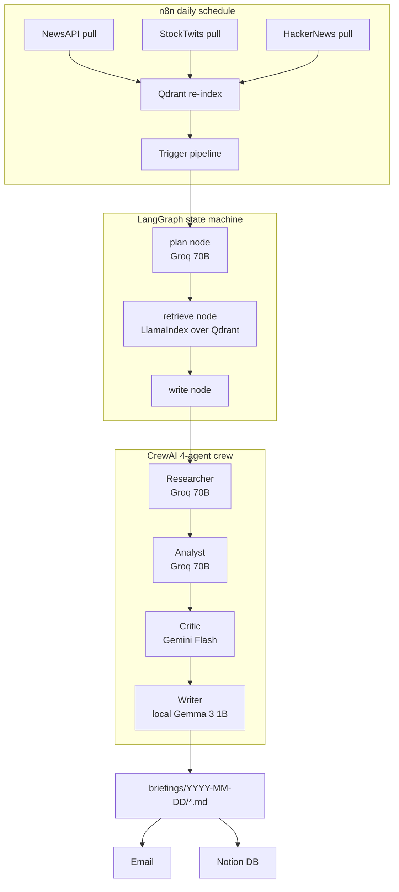

# AMIA: Autonomous Market Intelligence Agent

A multi-agent system that produces a daily briefing for 5 stock tickers (AAPL, TSLA, NVDA, MSFT, AMZN) by pulling news, retail sentiment, and tech discussion, retrieving the relevant slice via RAG, and writing a citation-backed summary through a 4-agent crew.

Built on a Mac M3 with 8GB RAM and **a $0 monthly bill** — everything runs on local Ollama plus free API tiers.

## What it does

Each morning, n8n triggers an ingestion run that pulls:

1. NewsAPI articles, ~40 per ticker
2. StockTwits messages with bullish/bearish sentiment labels
3. HackerNews stories via the Algolia API

Those land in a Qdrant vector index. A LangGraph state machine (plan → retrieve → write) then produces 5 briefings, one per ticker, and n8n delivers them to email + Notion.

The "write" node is a 4-agent CrewAI crew: researcher, analyst, critic, writer. Different agents run on different models on purpose — see the model split below.

## Architecture



Why so many frameworks? Each one earned a specific job:

1. **LangChain** wraps tools and prompts. Lightest layer, mostly glue.
2. **LangGraph** runs the state machine. Conditional retry edges on empty retrieval.
3. **LlamaIndex** owns retrieval, metadata filters, and the sub-question query engine that splits "compare news vs retail" questions across two indices.
4. **CrewAI** owns multi-agent orchestration. Sequential tasks with each agent's output feeding the next.
5. **n8n** owns scheduling and delivery. No Python cron jobs.

## Model split

| Agent | Model | Why |
|---|---|---|
| Planner | Groq Llama 3.3 70B | Fast, cheap, free 100k TPD. Good at "what should I research about X" questions. |
| Researcher | Groq Llama 3.3 70B | Reads ~5k tokens of context, picks 3 signals. 70B handles the abstraction. |
| Analyst | Groq Llama 3.3 70B | Catalyst/risk reasoning over researcher's findings. |
| Critic | Gemini 2.0 Flash | Different vendor on purpose. Stops the analyst-anchoring problem where the same model agrees with itself. |
| Writer | Local Gemma 3 1B via Ollama | The portfolio reason — touch a local LLM end-to-end. The post-processing layer compensates for its weaknesses. |

When Groq's TPD hits 100k, every Groq call (planner + researcher + analyst) auto-falls-back to Gemini Flash via `litellm.fallbacks`. The eval below was partly served by Gemini after Groq capped, and the score didn't move.

## How news and social signals are weighted

The retrieval node hard-filters by ticker, then blends three sources:

1. Top 8 docs by similarity (mostly news, some social)
2. Plus 2 forced StockTwits docs for that ticker (cross-source coverage)
3. Plus 2 forced HackerNews docs for that ticker

Then deduplicates by URL. This pattern came out of an eval finding: vector similarity alone almost never surfaces StockTwits, so cross-source questions starved without an explicit quota.

The analyst prompt treats StockTwits sentiment as a secondary signal, never a primary driver. The critic agent specifically flags low-volume or shallow sentiment claims.

## Eval results

A 10-question eval set (5 news-only, 5 cross-source) scored on retrieval pass rate (did the right source types come back?) and reasoning average (did the briefing mention the expected keywords?).

| Metric | Baseline | + Code fixes | + Index rebuild | + Gemini fallback |
|---|---|---|---|---|
| Retrieval pass rate | 70% | 70% | 90% | **100%** |
| Reasoning avg | 25% | 35% | 40% | **48%** |
| Cross-source retrieval | 40% | 40% | 80% | **100%** |
| Cross-source reasoning | 15% | 30% | 25% | **45%** |

What each column actually was:

1. **Baseline.** Day 10 eval. Retrieval was leaking across tickers, writer was hallucinating Bloomberg URLs that didn't exist, StockTwits never surfaced.
2. **Code fixes.** Day 11 morning. Added ticker metadata filter, StockTwits quota, URL post-processing in the write node.
3. **Index rebuild.** Day 11 afternoon. Diagnostic showed Qdrant had 293 zombie HackerNews docs from an old ingestion and zero StockTwits docs despite 74 on disk. Rebuilt the index.
4. **Gemini fallback.** Day 12. Wired `litellm.fallbacks` so a Groq TPD bust no longer kills the run. Reasoning still went up — Gemini wasn't worse at the reasoning task.

The takeaway is structural fixes outscore prompt tuning. Three of the four jumps came from data discipline (ticker filter, source quotas, fresh index), not from rewriting prompts.

## Stack

| Layer | Choice | Free tier note |
|---|---|---|
| Embeddings | nomic-embed-text via Ollama | local, $0 |
| Vector store | Qdrant (Docker) | local, $0 |
| Heavy reasoning | Groq Llama 3.3 70B | 100k TPD free |
| Diversity model | Gemini 2.0 Flash | 1500 RPD free |
| Local writer | Gemma 3 1B via Ollama | local, $0 |
| Tracing | self-hosted Langfuse | local, $0 |
| Orchestration | n8n via npm | local, $0 |
| News | NewsAPI | 100 RPD free |
| Social | StockTwits public API + HackerNews Algolia | no auth, no limit |
| Delivery | Notion API + email | free |

## Setup

```bash
git clone https://github.com/KittituchW/autonomous-market-intelligence-agent.git
cd autonomous-market-intelligence-agent
python3 -m venv venv && source venv/bin/activate
pip install -r requirements.txt

# pull local models
ollama pull nomic-embed-text
ollama pull gemma3:1b

# start qdrant
docker run -d -p 6333:6333 qdrant/qdrant

# .env needs: GROQ_API_KEY, GEMINI_API_KEY, NEWSAPI_KEY
cp .env.example .env  # then fill it in

# pull data and build index
python ingest.py
python social_ingest.py
python retrieval.py    # builds Qdrant index

# smoke test on TSLA
python graph.py

# 5-ticker run
python run_briefings.py
```

## Reliability

A few things make this survive an unattended daily run:

1. **Groq → Gemini fallback** via `litellm.fallbacks` for the crew, plus a try/except wrapper in the planner. Eval above was partly served by Gemini after Groq capped.
2. **6-hour disk cache** on `retrieve_with_sources` keyed by `(query, ticker, top_k)`. Skips the Ollama embed and Qdrant query on hits.
3. **NewsAPI pre-flight counter** in `ingest.py` bails before the call when the day's 100 are spent. Counter resets at UTC midnight.
4. **Per-provider token usage log** at `logs/token_usage.jsonl`. `python usage_log.py` prints daily totals against known free-tier limits.

## Project structure

```
ingest.py            # NewsAPI pull, 100/day pre-flight counter
social_ingest.py     # StockTwits + HackerNews pull
retrieval.py         # LlamaIndex + Qdrant, ticker filter, social quota, disk cache
subquery.py          # SubQuestionQueryEngine for cross-source questions
graph.py             # LangGraph state machine, planner, fallback, URL post-processing
crew.py              # 4-agent CrewAI crew with model split + litellm fallback
tracing.py           # Langfuse callback wiring
usage_log.py         # per-provider token tracker
diagnose_index.py    # Qdrant payload audit (catches stale index)
run_briefings.py     # CLI loop over 5 tickers
evals/run_eval.py    # 10-question eval, scores retrieval + reasoning
n8n/                 # workflow exports
```

## What I'd do next

1. **LLM judge for reasoning eval.** Keyword overlap is too noisy at n=10. A small Gemini-Flash-as-judge pass would be more honest.
2. **Property graph index** over companies and execs. LlamaIndex supports it and the cross-company analyst questions ("how does Intel earnings move AMZN's chip narrative") would benefit.
3. **Backtesting agent** on historical news + StockTwits. The hardest part is labeling — what counts as a "good" briefing in hindsight.
4. **Fine-tuned Gemma writer** on past briefings, so the local writer doesn't need the URL post-processing crutch.

## Constraints worth naming

8GB RAM is the real constraint. Ollama, Qdrant Docker, n8n, Chrome, and Cursor cannot all run simultaneously. The compromise is: Qdrant via Docker, Ollama only loads when the writer agent fires, n8n via npm not Docker. Gemma 3 4B was too heavy at the writer node — dropped to 1B and added URL post-processing to compensate.

No paid APIs. No Reddit either — Reddit's API approval is unreliable, X is paid, so social signal comes from StockTwits and HackerNews only.

## License

MIT.
